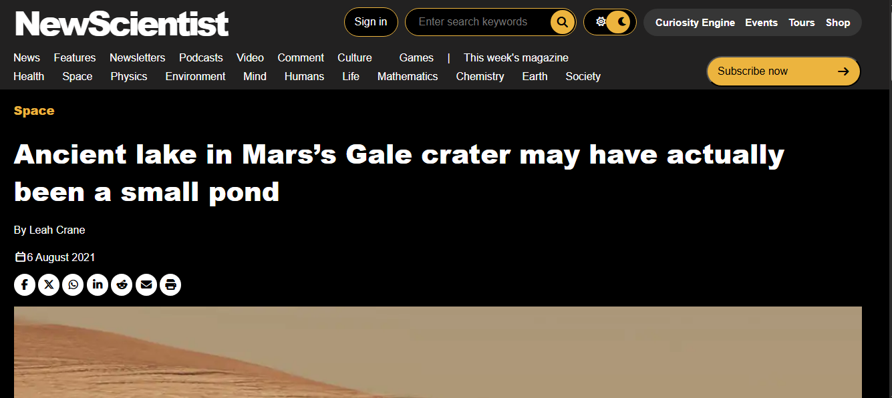
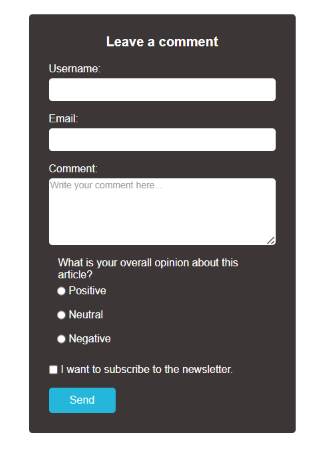

# New Scientist News Page Clone with a comment form

A HTML/CSS landing page inspired by [New Scientist](https://www.newscientist.com/article/2286218-ancient-lake-in-marss-gale-crater-may-have-actually-been-a-small-pond/)

## Live Demo

[Live Demo link](https://veeruby18.github.io/NY-position_project/)

[Comment form Live link](https://veeruby18.github.io/NY-position_project/Form/form.html)

## Project Files

- index.html — main page content
- style.css - style page content
- Images — icon and image
- form.html - form page content
- form.css - form style

## Built With

- HTML5
- CSS3

## 👤 Author

Vantia Odu
GitHub: [@Veeruby18](https://github.com/Veeruby18)

## Contributions

- Contributions, issues, and feature requests are welcome!

## ⭐ Support

Give a ⭐️ if you like this project!
